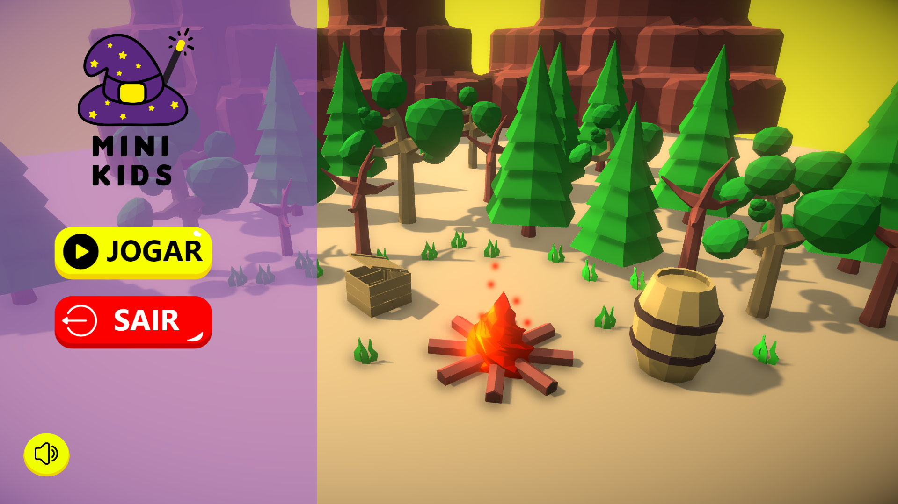
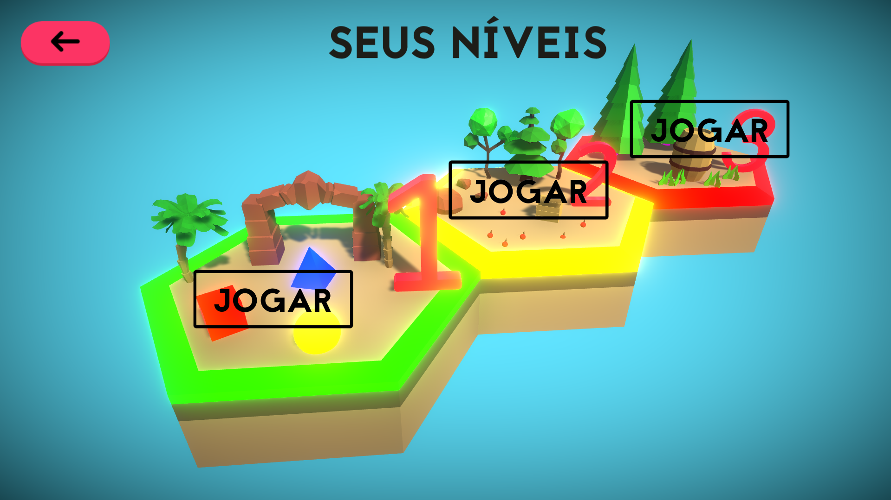
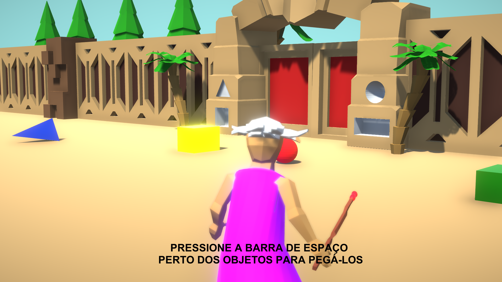

<h1 align="right">
  
  Mini Kids
</h1>

<p align="right">
  An educational game guided by the National Common Curricular Base
  <br><br>
  <!-- License -->
  <a>
    
  </a>
</p>
<br>

## :eyes: Overview

> Play on Itch.io: https://pferreirafabricio.itch.io/mini-kids

<p align="center">
   <br/><br/>
   <br/><br/>
   <br/><br/>
</p>

## :open_book: About 
The Mini Kids has as its main objective the education of children inserted in the stage of early childhood education and elementary school I, using a virtual educational game as a tool for this, having as a basis for its development official guiding documents, such as the BNCC, DCNEI, and RCNEI, etc.

## :bricks: This project was built with: 
- [Unity](https://unity.com/)
- [C#](https://docs.microsoft.com/en-us/dotnet/csharp/)
- [Blender](https://www.blender.org/)

## 🏄‍♂️ Quick Start
 1. Clone this repository `git clone https://github.com/pferreirafabricio/mini-kids.git`;
 2. Open `min-kids` folder with Unity and be happy 😄.
 
## :recycle: Contribute
 1. Fork this repository
 2. Create a branch with your feature: ```git checkout -b my-feature```
 3. Commit your changes: ```git commit -m 'feat: My new feature'```
 4. Push your branch: ```git push origin my-feature```

## :page_with_curl:	License
This project is under the GPL-3.0 license. Take a look at the [LICENSE](LICENSE) file for more details.

## 📚 Learn more

  * BNCC: http://basenacionalcomum.mec.gov.br/
  * DCNEI: http://portal.mec.gov.br/dmdocuments/diretrizescurriculares_2012.pdf
  * RCNEI: http://portal.mec.gov.br/seb/arquivos/pdf/rcnei_vol1.pdf
